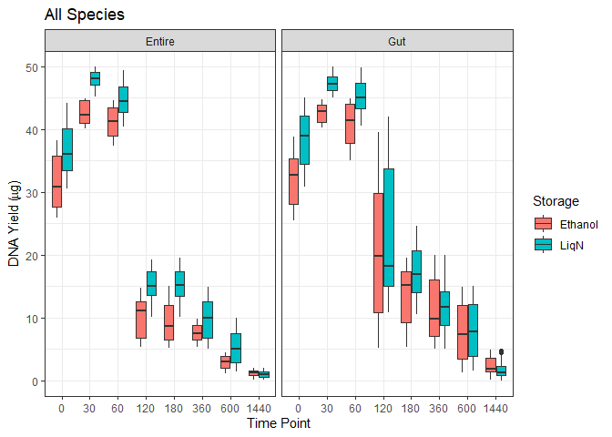
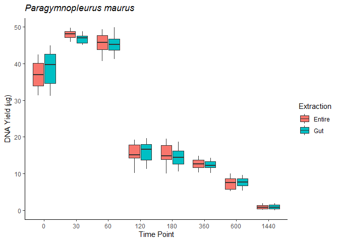
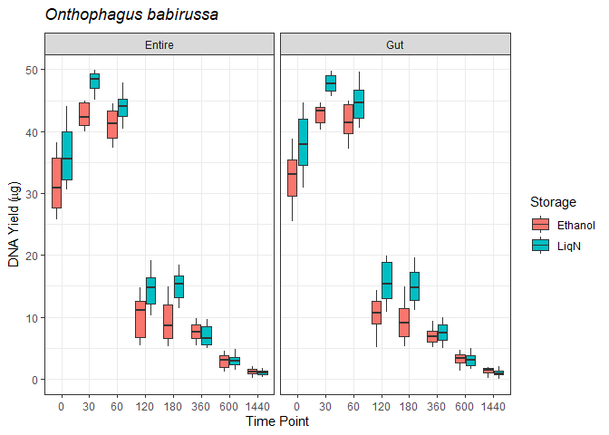

Plots and analyses for dummy DNA yield dataset
================
Xin Rui

### Packages to install and load

``` r
library(ggplot2) ## for plotting
library(dplyr) ## for data manipulation
```

### Load and check data

``` r
yield <- read.csv("DNA yield_cleaned.csv", header=T)
colnames(yield)[1] <-"SpecimenID" ## rename first column header
names(yield) ## check all column headers
```

    ## [1] "SpecimenID" "Species"    "DungType"   "TimePt"     "Storage"   
    ## [6] "Extraction" "DNAPurity"  "DNAYield"

``` r
str(yield) ## check data frame
```

    ## 'data.frame':    1280 obs. of  8 variables:
    ##  $ SpecimenID: chr  "CM0001" "CM0002" "CM0003" "CM0004" ...
    ##  $ Species   : chr  "Catharsius_molossus" "Catharsius_molossus" "Catharsius_molossus" "Catharsius_molossus" ...
    ##  $ DungType  : chr  "Elephant" "Elephant" "Elephant" "Elephant" ...
    ##  $ TimePt    : int  0 0 0 0 0 0 0 0 0 0 ...
    ##  $ Storage   : chr  "LiqN" "LiqN" "LiqN" "LiqN" ...
    ##  $ Extraction: chr  "Gut" "Gut" "Gut" "Gut" ...
    ##  $ DNAPurity : num  0.705 1.994 0.144 1.36 1.093 ...
    ##  $ DNAYield  : num  31 39.7 37.1 36.1 38.9 ...

``` r
yield$TimePt <- as.factor(yield$TimePt) # change TimePt to factor
str(yield) ## check again
```

    ## 'data.frame':    1280 obs. of  8 variables:
    ##  $ SpecimenID: chr  "CM0001" "CM0002" "CM0003" "CM0004" ...
    ##  $ Species   : chr  "Catharsius_molossus" "Catharsius_molossus" "Catharsius_molossus" "Catharsius_molossus" ...
    ##  $ DungType  : chr  "Elephant" "Elephant" "Elephant" "Elephant" ...
    ##  $ TimePt    : Factor w/ 8 levels "0","30","60",..: 1 1 1 1 1 1 1 1 1 1 ...
    ##  $ Storage   : chr  "LiqN" "LiqN" "LiqN" "LiqN" ...
    ##  $ Extraction: chr  "Gut" "Gut" "Gut" "Gut" ...
    ##  $ DNAPurity : num  0.705 1.994 0.144 1.36 1.093 ...
    ##  $ DNAYield  : num  31 39.7 37.1 36.1 38.9 ...

### Filter data by species

``` r
yield_Catharsius <- yield %>% filter(Species == "Catharsius_molossus")
yield_Paragymnopleurus <- yield %>% filter(Species == "Paragymnopleurus_maurus")
yield_Onthophagus <- yield %>% filter(Species == "Onthophagus_babirussa")
```

### Plot data

``` r
yield %>% ggplot()+
  geom_boxplot(aes(x=TimePt, y=DNAYield, fill=Storage))+
  facet_wrap(~Extraction)+
  xlab("Time Point")+
  ylab(expression(paste("DNA Yield (", mu, "g)"))) +
  ggtitle("All Species")+
  theme_bw()
```

<!-- -->

``` r
yield_Catharsius %>% ggplot()+
  geom_boxplot(aes(x=TimePt, y=DNAYield, fill=Storage))+
  xlab("Time Point")+
  ylab(expression(paste("DNA Yield (", mu, "g)"))) +
  ggtitle(expression(paste(italic("Catharsius molossus"))))+
  theme_classic()
```

<!-- -->

``` r
yield_Paragymnopleurus %>% ggplot()+
  geom_boxplot(aes(x=TimePt, y=DNAYield, fill=Extraction))+
  xlab("Time Point")+
  ylab(expression(paste("DNA Yield (", mu, "g)"))) +
  ggtitle(expression(paste(italic("Paragymnopleurus maurus"))))+
  theme_classic()
```

<!-- -->

``` r
yield_Onthophagus %>% ggplot()+
  geom_boxplot(aes(x=TimePt, y=DNAYield, fill=Storage))+
  facet_wrap(~Extraction)+
  xlab("Time Point")+
  ylab(expression(paste("DNA Yield (", mu, "g)"))) +
  ggtitle(expression(paste(italic("Onthophagus babirussa"))))+
  theme_bw()
```

<!-- -->

### Linear models

#### All species models

``` r
m1 <- lm(DNAYield~TimePt + Storage + Extraction, data=yield)
m2 <- lm(DNAYield~TimePt * Storage + Extraction, data=yield)
anova(m1,m2)
```

    ## Analysis of Variance Table
    ## 
    ## Model 1: DNAYield ~ TimePt + Storage + Extraction
    ## Model 2: DNAYield ~ TimePt * Storage + Extraction
    ##   Res.Df   RSS Df Sum of Sq      F    Pr(>F)    
    ## 1   1270 26557                                  
    ## 2   1263 25115  7    1442.4 10.363 1.081e-12 ***
    ## ---
    ## Signif. codes:  0 '***' 0.001 '**' 0.01 '*' 0.05 '.' 0.1 ' ' 1

``` r
m3 <- lm(DNAYield~TimePt + Storage + Extraction + TimePt:Storage + TimePt:Extraction, data=yield)
anova(m2, m3)
```

    ## Analysis of Variance Table
    ## 
    ## Model 1: DNAYield ~ TimePt * Storage + Extraction
    ## Model 2: DNAYield ~ TimePt + Storage + Extraction + TimePt:Storage + TimePt:Extraction
    ##   Res.Df   RSS Df Sum of Sq      F    Pr(>F)    
    ## 1   1263 25115                                  
    ## 2   1256 22924  7    2190.4 17.144 < 2.2e-16 ***
    ## ---
    ## Signif. codes:  0 '***' 0.001 '**' 0.01 '*' 0.05 '.' 0.1 ' ' 1

``` r
anova(m3)
```

    ## Analysis of Variance Table
    ## 
    ## Response: DNAYield
    ##                     Df Sum Sq Mean Sq  F value    Pr(>F)    
    ## TimePt               7 327604   46801 2564.158 < 2.2e-16 ***
    ## Storage              1   2332    2332  127.746 < 2.2e-16 ***
    ## Extraction           1   1750    1750   95.882 < 2.2e-16 ***
    ## TimePt:Storage       7   1442     206   11.290 6.193e-14 ***
    ## TimePt:Extraction    7   2190     313   17.144 < 2.2e-16 ***
    ## Residuals         1256  22924      18                       
    ## ---
    ## Signif. codes:  0 '***' 0.001 '**' 0.01 '*' 0.05 '.' 0.1 ' ' 1

#### *Catharsius molossus* models

``` r
catharsius_m1<-lm(DNAYield~TimePt+Storage, data=yield_Catharsius)
catharsius_m2<-lm(DNAYield~TimePt*Storage, data=yield_Catharsius)
anova(catharsius_m1,catharsius_m2)
```

    ## Analysis of Variance Table
    ## 
    ## Model 1: DNAYield ~ TimePt + Storage
    ## Model 2: DNAYield ~ TimePt * Storage
    ##   Res.Df    RSS Df Sum of Sq      F    Pr(>F)    
    ## 1    311 2808.2                                  
    ## 2    304 2223.5  7    584.63 11.418 7.232e-13 ***
    ## ---
    ## Signif. codes:  0 '***' 0.001 '**' 0.01 '*' 0.05 '.' 0.1 ' ' 1

``` r
anova(catharsius_m2)
```

    ## Analysis of Variance Table
    ## 
    ## Response: DNAYield
    ##                 Df Sum Sq Mean Sq  F value    Pr(>F)    
    ## TimePt           7  64437  9205.3 1258.540 < 2.2e-16 ***
    ## Storage          1    894   894.1  122.243 < 2.2e-16 ***
    ## TimePt:Storage   7    585    83.5   11.418 7.232e-13 ***
    ## Residuals      304   2224     7.3                       
    ## ---
    ## Signif. codes:  0 '***' 0.001 '**' 0.01 '*' 0.05 '.' 0.1 ' ' 1

#### *Paragymnopleurus maurus* models

``` r
paragymnopleurus_m1<-lm(DNAYield~TimePt+Extraction, data=yield_Paragymnopleurus)
paragymnopleurus_m2<-lm(DNAYield~TimePt*Extraction, data=yield_Paragymnopleurus)

anova(paragymnopleurus_m1, paragymnopleurus_m2)
```

    ## Analysis of Variance Table
    ## 
    ## Model 1: DNAYield ~ TimePt + Extraction
    ## Model 2: DNAYield ~ TimePt * Extraction
    ##   Res.Df    RSS Df Sum of Sq      F Pr(>F)
    ## 1    311 1728.7                           
    ## 2    304 1674.4  7     54.35 1.4097 0.2008

``` r
anova(paragymnopleurus_m1)
```

    ## Analysis of Variance Table
    ## 
    ## Response: DNAYield
    ##             Df Sum Sq Mean Sq   F value Pr(>F)    
    ## TimePt       7  90742 12963.1 2332.0771 <2e-16 ***
    ## Extraction   1      0     0.2    0.0418 0.8382    
    ## Residuals  311   1729     5.6                     
    ## ---
    ## Signif. codes:  0 '***' 0.001 '**' 0.01 '*' 0.05 '.' 0.1 ' ' 1

#### *Onthophagus babirussa* models

``` r
onthophagus_m1<-lm(DNAYield~TimePt+Storage, data=yield_Onthophagus)
onthophagus_m2<-lm(DNAYield~TimePt+Storage+Extraction, data=yield_Onthophagus)

anova(onthophagus_m1, onthophagus_m2)
```

    ## Analysis of Variance Table
    ## 
    ## Model 1: DNAYield ~ TimePt + Storage
    ## Model 2: DNAYield ~ TimePt + Storage + Extraction
    ##   Res.Df    RSS Df Sum of Sq      F Pr(>F)
    ## 1    631 4578.3                           
    ## 2    630 4560.5  1    17.762 2.4537 0.1177

``` r
onthophagus_m3<-lm(DNAYield~TimePt*Storage, data=yield_Onthophagus)
anova(onthophagus_m1, onthophagus_m3)
```

    ## Analysis of Variance Table
    ## 
    ## Model 1: DNAYield ~ TimePt + Storage
    ## Model 2: DNAYield ~ TimePt * Storage
    ##   Res.Df    RSS Df Sum of Sq      F    Pr(>F)    
    ## 1    631 4578.3                                  
    ## 2    624 3578.3  7      1000 24.913 < 2.2e-16 ***
    ## ---
    ## Signif. codes:  0 '***' 0.001 '**' 0.01 '*' 0.05 '.' 0.1 ' ' 1

``` r
anova(onthophagus_m3)
```

    ## Analysis of Variance Table
    ## 
    ## Response: DNAYield
    ##                 Df Sum Sq Mean Sq  F value    Pr(>F)    
    ## TimePt           7 183566 26223.7 4573.054 < 2.2e-16 ***
    ## Storage          1   1386  1386.1  241.710 < 2.2e-16 ***
    ## TimePt:Storage   7   1000   142.9   24.913 < 2.2e-16 ***
    ## Residuals      624   3578     5.7                       
    ## ---
    ## Signif. codes:  0 '***' 0.001 '**' 0.01 '*' 0.05 '.' 0.1 ' ' 1
